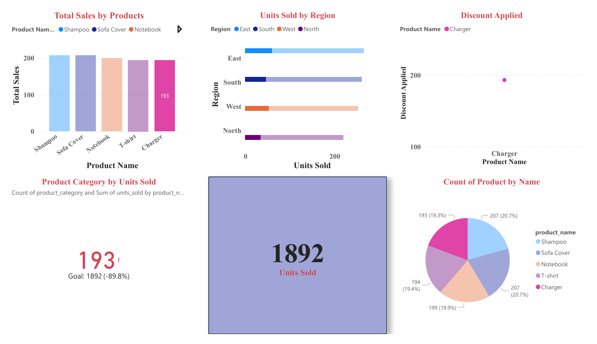

# Task 2: Data Visualization and Storytelling (Power BI)

## Project Overview
This project focuses on creating meaningful data visualizations using Power BI to communicate business insights effectively. The dashboard is designed to convert raw sales data into clear, actionable insights through structured visual storytelling.

---

## Objective
- Design clear and professional visualizations
- Highlight key business insights from sales data
- Follow best practices in dashboard layout and storytelling
- Support data-driven decision-making

---

## Tools & Technologies
- Power BI Desktop
- Dataset: Superstore Sales Dataset (CSV)

---

## Dataset Description
The dataset contains historical sales transactions with the following key fields:
- Order Date
- Sales
- Profit
- Category and Sub-Category
- Region
- Customer Segment

This data enables analysis of revenue trends, profitability, regional performance, and customer segments.

---

## Dashboard Layout

### 1. KPI Cards (At-a-Glance Overview)
Provides a high-level summary of business performance:
- **Total Sales** – Overall revenue generated
- **Total Profit** – Net profitability across all orders
- **Profit Margin (%)** – Efficiency of converting sales into profit

---

### 2. Trend Analysis
- **Sales Over Time (Line Chart)**
  - Displays sales trends across months and years
  - Helps identify growth patterns and seasonality

---

### 3. Performance Comparison
- **Sales & Profit by Category (Bar Chart)**
  - Compares revenue and profitability across product categories
- **Sales by Region (Map or Bar Chart)**
  - Highlights top-performing and underperforming regions

---

### 4. Deep Dive Analysis
- **Sales vs Profit (Scatter Plot)**
  - Identifies products with high sales but low or negative profit
- **Segment-wise Contribution (Donut / Stacked Bar Chart)**
  - Shows contribution of Consumer, Corporate, and Home Office segments

---

### 5. Insights Panel
Key business observations derived from the dashboard:
- Technology is the most profitable category
- Furniture shows high sales but low profit margins
- The West region contributes the highest sales
- High sales do not always result in high profit

---

## Key Learnings
- Importance of choosing the right chart for the right data
- Using calculated measures like Profit Margin for deeper analysis
- Clean layout and minimal clutter improve dashboard clarity
- Business insights are more important than decorative visuals

---

## Deliverables
- Interactive Power BI Dashboard
- Dashboard screenshots or exported PDF
- README documentation

---

## Dashboard Preview

## Conclusion
This project demonstrates how effective data visualization and storytelling can transform raw sales data into actionable business insights. The dashboard follows a structured flow from summary metrics to detailed analysis, ensuring clarity and impact.

---

## Author
**Badri Narayanan**  
Computer Science & Engineering  
Data Visualization & Analytics
